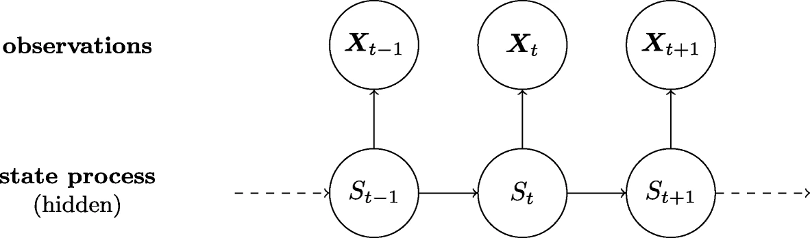

```{r, include = FALSE}
knitr::opts_chunk$set(
  collapse = TRUE,
  comment = "#>"
)
```


```{r, include = FALSE}
library(gghmm2)
```
\section{Hidden Markov model}
##Hidden Markov Model
Hidden Markov model (HMM) is a statistical Markov model *S* where *S* is being model by a Markov process with hidden states. In other words *S* - which will be called the hidden state - can not be observed directly so we instead model on *X* which from now on will be called the observable states. Thus we learn about *S* at *t=t~0~* from *X* at *t=t~0~*.


{width=50%}

{width=20%}


##The package

\section{The package}
To see how the package works, we will cover a example of it, using the earthquakes data contained in the package. First we load that data set and build the model we will be using. We will be trying to fit a $2$ state hidden markom model where the states emit from a poisson distribution. So we set *emis_names* to "dpois" to tell the model that we 
Here we use the HMM function to create the model. 

```{r}
X <- earthquakes$n
delta = c(0.5,0.5)
trans=matrix(c(0.9,0.1,0.1,0.9),2,2)
HM = HMM(initial_dist = delta,transmission = trans,
         emis_names = "dpois",parm1 = c(10,30) )
HM
```
Note that the print of the model, tells us how many hidden states the model has and the parameters values. As a alternative to using *parm1* the user could also have used *parameterlist = list(list(lambda=10),list(lambda=30))*. However as we are only using one parameter for each distribution, then it is easier to just use *parm1*. 


To use the forward and backward algorithms, the user can use the forward and backward functions. They just need to be supplied with the the model as *HM* and the data as *X*.  

```{r}
n = length(X)
FM = forward(HM=HM,X=X)
sum(FM[,n])
BM = backward(HM,X)
```

To find the probability of being at a certain state *state* at a time *state_time*, we can use *state_prob*. Again the user also need to provide a model as *HMM* and the data as *X*. Note that we cannot calculate the  probability for a time bigger then the size of the data. So if we have a sequence of *10* observation, then *state_time* cannot be larger then *10*. 
```{r}
state_prob(state = 1, state_time = 10, HM = HM, X = X)
```
The package also have both a local and global decoder. The local decoder function is called *local_decoder* and will return a vector of hidden states.   
```{r}
local_decoder(X,HM)
```
The global decoder is called Viterbi and will return a list. The list contains the path with the highest probability of emitting  *X* and the probability  of getting this path. 

```{r}
viterbi(HM,X)
```

The forecast function allow the used to check what the probability of getting a state at a time in future will be. Here the user need to provide the state as a index as the variable *pred_obs* , and the time as *pred_time*. 
```{r}
forecast(2,10,HM=HM,X=X)
```
To last the user can use the Expectation–maximization algorithm to fit their data to a *HMM*. Here the user need to provide the data and a HMM object, which contain the initial guess for the parameters. The function will return *HMM* object, but now with the new parameters. 
```{r}
HM2 = em(HM,X)
HM2
```


A alternative example could be a fit of the normal distribution 

```{r}
HMN = HMM(initial_dist = delta,transmission = trans,
         emis_names = "dnorm",parameterlist = list(list(mean=10,sd=1),list(mean=20,sd=1)) )
HMN
HMN2 = em(HMN,X)
HMN2
```

